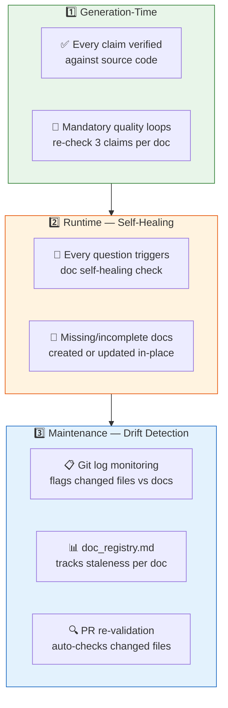
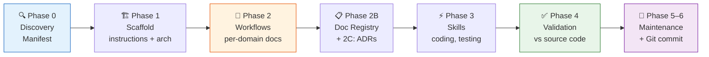
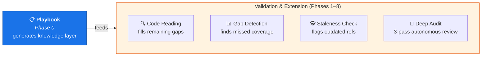

# 📋 Playbook — Knowledge Layer Generator

> *Phase 0 of the [Playbook framework](README.md) — the foundation everything else builds on.*

The Playbook generates a **knowledge layer** — not a summary layer — that bootstraps AI-native documentation for any codebase. It creates the foundational docs that Copilot (and developers) need to navigate, code, debug, and review with full context.

🔙 **[← Back to main README](README.md)**

---

## What Makes Playbook Unique

### 🔬 Deep Analysis — Not Summaries

Most doc generators skim files and produce thin summaries. Playbook enforces a **depth-over-breadth** mandate:

| Conventional doc tools | Playbook |
|----------------------|----------|
| Read class signatures and comments | Reads **method bodies** — conditionals, catch blocks, retry loops |
| Generic error tables ("invalid input") | **Real error codes** extracted from actual catch blocks |
| Config tables from parameter names | **Actual config keys** traced to where they're read and used |
| 3-step workflows ("receives → processes → returns") | **≥5 steps** with real method names and file paths |
| Placeholders ("TBD", "see code") | **Zero placeholders** — empty cell > hallucinated cell |

### 🔄 Living Documentation — Self-Healing Built In

Docs rot because nothing enforces freshness. Playbook solves this at **three levels**:



1. **Generation-time verification** — Every claim (class name, method call, config key) is verified by reading actual source. A mandatory quality loop re-checks 3 claims per doc and fixes errors.

2. **Runtime self-healing** — Every question asked by subsequent pipeline phases includes a self-healing suffix. If the answer reveals missing or incomplete docs, Copilot creates or updates them automatically. The docs grow as the pipeline runs.

3. **Maintenance drift detection** — Phase 5 monitors git log for changed files, cross-references against docs, flags stale references, and updates `doc_registry.md`. PR re-validation checks that changed code still matches its docs.

### 📊 Documentation Registry — Single Source of Truth

The `doc_registry.md` is a living inventory that answers *"what's documented, what's not, and what's stale?"*:

- **Documented controllers** — which workflow doc covers each, section completeness (N/14), last verified date
- **Undocumented controllers** — everything the code has that docs don't cover
- **Coverage summary** — percentage tracked, automatically updated by every pipeline phase
- **Staleness tracking** — docs with `last-verified` > 30 days flagged for re-validation
- **Audit trail** — records each run with question count, depth, and domains covered

### 🐵 Autonomous Deep Audit

The pipeline includes an autonomous auditor that runs a **3-pass strategy**:

| Pass | Strategy | Goal |
|------|----------|------|
| **Pass 0 — Discovery** | Scans all controllers, diffs against existing docs | Find invisible controllers |
| **Pass 1 — Breadth** | Reads code FIRST → forms questions → searches docs to answer | Cover ALL domains (2–3 Qs each) |
| **Pass 2 — Depth** | Drills into weak domains from Pass 1 | Stay in one domain until solid |

Each question follows a 5-phase loop: **ASK** (read code) → **ANSWER** (search docs) → **JUDGE** (✅/⚠️/❌) → **FIX** (self-heal if gap) → **DOMAIN LOGIC** (skip solid domains, dig into weak ones).

### 🏗️ Large Repo Strategy (100K+ lines)

| Challenge | Solution |
|-----------|----------|
| Context limits | Chunked execution — workflows in batches of 3–5 domains |
| Session breaks | Anchor-file resume — re-reads Discovery Manifest to stay grounded |
| Partial failures | Scope narrowing — re-run only missing items, not the full phase |
| Manifest drift | Discovery Manifest updated when later phases discover new domains |

---

## What It Generates

```
your-repo/
├── .github/
│   ├── copilot-instructions.md     ← Conventions, patterns, architecture rules
│   ├── copilot-memory.md           ← Architecture layers, key paths, data flow
│   └── skills/                     ← Specialized prompts (coding, testing, reviewing)
│
└── docs/{KB_NAME}/
    ├── Discovery_Manifest.md       ← Repo map — domains, entry points, languages
    ├── Architecture_Memory.md      ← Full architecture reference
    ├── Telemetry_And_Logging.md    ← Log tables, correlation keys, queries
    ├── ErrorCode_Reference.md      ← Error catalog: meaning, cause, debug steps
    ├── Glossary.md                 ← Acronyms and domain terms
    ├── doc_registry.md             ← Living inventory — coverage + staleness tracking
    ├── exemplars/
    │   └── Code_Exemplars.md       ← Gold-standard patterns from real code
    └── workflows/
        ├── 01_Feature_Workflow.md   ← Per-domain: API flows, errors, config
        ├── 02_Feature_Workflow.md
        └── ...
```

## How It Works

The Playbook is a **75KB mega-prompt** (`prompts/playbook.txt`) executed in Copilot agent mode. It runs 7 phases sequentially:



### Verification — Prove Your Work

The quality loop after each phase is **mandatory, not optional**:
- Pick 3 claims per doc (class names, paths, config keys)
- Read actual source to verify each claim
- Fix anything wrong, add detail where thin
- Output a verification table: Document → Claim → Source File → Result

## Usage

### Via Monkey Army Orchestrator (recommended)

The orchestrator runs the Playbook automatically as Phase 0 when needed:

```powershell
.\Run-Player.ps1 -RepoPath "C:\myrepo" -Pack full
```

The orchestrator includes **playbook skip detection** — if the repo already has a knowledge layer (score ≥3 from 5 signals), it skips Phase 0. Override with `-ForcePlaybook`.

Skip signals checked:
1. `copilot-instructions.md` exists and >500 bytes
2. `Discovery_Manifest.md` exists
3. ≥3 workflow docs found
4. `.github/skills/` with `.md` files
5. Recent git log mentions "playbook" or "knowledge layer"

### Standalone

```powershell
.\monkey-army\playbook-runner.ps1 -RepoPath "C:\myrepo" -Commit -Model "claude-sonnet-4"
```

### Manual (paste prompts directly)

1. Open Copilot Chat in **agent mode**
2. Paste prompts from `prompts/playbook.txt` phase by phase
3. Replace `{DOCS_ROOT}` and `{SKILLS_ROOT}` with your paths

## Estimated Time

| Phase | Time | Splittable? |
|-------|------|-------------|
| 0 Discovery | 5–10 min | No |
| 1 Scaffold + Quality Loop | 20–35 min | No |
| 2 Workflows | 10–15 min/batch | Yes (3–5 domains) |
| 2B Doc Registry | 5–10 min | No |
| 2C ADRs | 10–20 min | Yes (5 ADRs/batch) |
| 3 Skills | 15–20 min | No |
| 4 Validation | 5–10 min/doc | Yes (per doc) |
| 5–6 Maintenance + Git | 10 min | No |

**Total**: ~2–4 hours for a large repo (100K+ lines), ~30–60 min for small repos.

## Configuration

The Playbook Runner accepts these parameters (collected upfront by the wizard):

| Parameter | Default | Description |
|-----------|---------|-------------|
| `-Model` | Auto-detect | Copilot model to use |
| `-Timeout` | 7200 (2h) | Agent mode timeout in seconds |
| `-DryRun` | false | Stage changes but don't commit |
| `-Commit` | false | Auto-commit after execution |

## Output Quality

The Playbook produces documentation verified against source code. After generation, subsequent pipeline phases validate and extend it:



- **Code Reading** (Phase 1) — reads entry points and asks questions to fill remaining gaps
- **Gap Detection** (Phase 2) — cross-references code vs docs to find missed coverage
- **Staleness Check** (Phase 7) — flags dead file paths, renamed classes, outdated references
- **Deep Audit** (Phase 8) — 3-pass autonomous audit across all domains

## Version History

| Version | Key Changes |
|---------|-------------|
| v2.9 | Current — deep analysis mandate, large repo strategy, anti-pattern detection |

## Files

| File | Description |
|------|-------------|
| `monkey-army/playbook-runner.ps1` | PowerShell wrapper that launches the Playbook in agent mode |
| `prompts/playbook.txt` | The 75KB mega-prompt (7 phases) |
| `prompts/curious-george-prompt.md` | Companion prompt for Phase 8 deep auditing |

---

🔙 **[← Back to main README](README.md)**
