# 🎭 Playbook — Autonomous Documentation Framework

> *Give any codebase to the Monkey Army. Get production-grade documentation back.*

A self-orchestrating documentation pipeline powered by **9 specialized AI agents** ("monkeys") and a **knowledge layer generator** — all driven by GitHub Copilot CLI. Works on **any codebase, any language**. Zero manual config.

```powershell
# One repo
.\Run-Player.ps1 -RepoPath "C:\myrepo" -Pack full -CommitMode commit

# Multiple repos as a playlist
.\Run-PlayerList.ps1 -Repos @("C:\repo-a", "https://github.com/org/repo-b.git") -Mode parallel
```

📖 **[Playbook deep-dive →](PLAYBOOK.md)** — How the knowledge layer generator works (Phase 0)

---

## Why Playbook?

| Problem | How Playbook solves it |
|---------|----------------------|
| Docs rot faster than code | 🐵 **Marcel** detects stale references; **doc self-healing** triggers on every question |
| New devs can't navigate large codebases | 📋 **Playbook** generates copilot-instructions, workflow docs, architecture maps |
| Security blind spots in undocumented code | 🦹 **Mojo Jojo** hunts crash-prone patterns; 👑 **King Louie** validates API contracts |
| Test coverage gaps hide behind LOC metrics | 🦍 **Donkey Kong** finds untested modules by file pairing, not code coverage % |
| AI agents hallucinate without grounding | 🐒 **Rafiki** reads every entry point; 🐵 **Abu** cross-references code vs docs |
| Manual doc efforts don't scale | 🐵 **Curious George** runs autonomously for hours — discovery → questions → fixes |

---

## Quick Start

```powershell
# 1. Clone playbook
git clone https://github.com/KoushikMakam/playbook.git
cd playbook

# 2. Run on your repo (interactive wizard guides you)
.\Run-Player.ps1 -RepoPath "C:\your-repo"

# 3. Or go fully non-interactive
.\Run-Player.ps1 -RepoPath "C:\your-repo" -Pack full -NonInteractive `
  -QuestionsPerEntry 10 -CommitMode commit -TargetAgents copilot
```

### Prerequisites

| Tool | Install | Required |
|------|---------|----------|
| PowerShell 7+ | `winget install Microsoft.PowerShell` | ✅ |
| Git 2.30+ | `winget install Git.Git` | ✅ |
| GitHub Copilot CLI | `npm install -g @githubnext/copilot-cli` | ✅ |
| Azure CLI | `winget install Microsoft.AzureCLI` | Only for ADO repos |
| GitHub CLI | `winget install GitHub.cli` | Only for GitHub PRs |

---

## Repository Structure

```
playbook/
├── Run-Player.ps1              ← ▶️  Player — single-repo orchestrator
├── Run-PlayerList.ps1          ← 📋 PlayerList — multi-repo playlist runner
├── README.md                   ← You are here
├── PLAYBOOK.md                 ← Knowledge layer generator deep-dive
│
├── monkey-army/                ← 🐒 All 9 monkey scripts
│   ├── playbook-runner.ps1     ←   Phase 0: Knowledge layer generator (agent-mode)
│   ├── rafiki.ps1              ←   Phase 1: Code reader — broad questions per entry point
│   ├── abu.ps1                 ←   Phase 2: Doc gap detective — code vs docs cross-ref
│   ├── diddy-kong.ps1          ←   Phase 3: Architecture mapper — deps, cycles, violations
│   ├── king-louie.ps1          ←   Phase 4: API contract validator — specs vs endpoints
│   ├── mojo-jojo.ps1           ←   Phase 5: Chaos finder — security, edge cases, crashes
│   ├── donkey-kong.ps1         ←   Phase 6: Test coverage hunter — untested modules
│   ├── marcel.ps1              ←   Phase 7: Stale doc detector — dead refs, renames
│   └── curious-george.ps1      ←   Phase 8: Deep autonomous auditor (agent-mode)
│
├── shared/                     ← 🔧 Shared infrastructure
│   ├── MonkeyCommon.psm1       ←   Core engine (retry, model, reporting, wizard, UI)
│   ├── GitProviders.psm1       ←   Pluggable git (ADO, GitHub, GitLab, plain git)
│   ├── DocHealthScorer.psm1    ←   Before/after doc health scoring (0–110)
│   └── CompletenessGate.psm1   ←   Contract-based completeness validation (DAG-like)
│
├── Run-Remediation.ps1         ← 🔧 Targeted remediation runner
│
└── prompts/                    ← 📝 AI prompts
    ├── playbook.txt            ←   75KB knowledge layer mega-prompt (7 phases)
    ├── curious-george-prompt.md←   3-pass autonomous auditor prompt
    └── doc-standard.md         ←   Canonical workflow doc standard (10+1 sections)
```

---

## Architecture


### Pipeline Flow

```mermaid
flowchart LR
    A["🧙 Wizard<br/>collect inputs"] --> B["✅ Preflight<br/>verify tools"]
    B --> C["🔀 Repo Setup<br/>clone/branch"]
    C --> D["🤖 Model Select<br/>auto-probe"]
    D --> E["📊 Health ①<br/>baseline score"]
    E --> F["🐒 Run Monkeys<br/>phase 0–8"]
    F --> G["🚦 Quality Gate<br/>pass/fail"]
    G --> H["🩹 Heal Mode<br/>retry failures"]
    H --> I["📊 Health ②<br/>delta score"]
    I --> J["💾 Commit<br/>stage changes"]
    J --> K["📬 PR Create<br/>ADO/GitHub"]
    K --> L["📄 Report<br/>JSON + console"]

    style A fill:#e3f2fd,stroke:#1565c0
    style E fill:#fff8e1,stroke:#f9a825
    style F fill:#fff3e0,stroke:#e65100
    style G fill:#fce4ec,stroke:#c62828
    style I fill:#fff8e1,stroke:#f9a825
    style L fill:#e8f5e9,stroke:#2e7d32
```



---

## The Roster — 9 Monkeys

| Phase | Monkey | Mode | What it does | Key metric |
|:-----:|--------|:----:|--------------|------------|
| 0 | 📋 **Playbook** | agent | Generates knowledge layer (instructions, skills, workflows, manifest) | Docs created |
| 1 | 🐒 **Rafiki** | prompt | Reads ALL entry points, asks broad questions per method | Entry points covered |
| 2 | 🐵 **Abu** | prompt | Cross-references code vs docs, finds & fills gaps | Gaps filled |
| 3 | 🐒 **Diddy Kong** | prompt | Maps dependencies, finds circular deps, orphans, layer violations | Cycles found |
| 4 | 👑 **King Louie** | prompt | Validates API contracts — specs vs actual endpoints | Contract mismatches |
| 5 | 🦹 **Mojo Jojo** | prompt | Hunts security issues, edge cases, crash-prone patterns | Risks flagged |
| 6 | 🦍 **Donkey Kong** | prompt | Finds untested files, under-tested modules | Untested files |
| 7 | 🙈 **Marcel** | prompt | Detects stale references — dead file paths, renamed classes | Stale refs found |
| 8 | 🐵 **Curious George** | agent | Deep 3-pass autonomous audit (discover → question → fix) | Domains audited |

> **Prompt mode** — one question at a time via `copilot -p`, per-question tracking, structured results.
> **Agent mode** — autonomous multi-hour session via `copilot --prompt`, reads/writes files directly.

📖 See **[PLAYBOOK.md](PLAYBOOK.md)** for Phase 0 deep-dive (the knowledge layer generator).

---

## Packs — Pick Your Squad

| Pack | Monkeys | Best for | Est. time |
|------|---------|----------|-----------|
| `full` | All 9 | Complete documentation overhaul | 4–8 hours |
| `audit` | Rafiki, Abu, Mojo Jojo | Quick code + doc + security sweep | 1–2 hours |
| `security` | Mojo Jojo, King Louie | Security & API contract focus | 30–60 min |
| `docs` | Playbook, Rafiki, Abu, Marcel | Doc generation & cleanup | 2–4 hours |
| `autonomous` | Playbook, Curious George | Hands-off agent-mode runs | 3–6 hours |
| `quick` | Rafiki, Abu | Fast code reading + gap detection | 30–60 min |

Or pick specific monkeys: `-Monkeys rafiki,mojo-jojo,marcel`

---

## Usage Examples

### ▶️ Single Repo (Run-Player)

```powershell
# Full pipeline — commit results
.\Run-Player.ps1 -RepoPath "C:\myrepo" -Pack full -CommitMode commit

# Quick audit — dry-run (no changes committed)
.\Run-Player.ps1 -RepoPath "C:\myrepo" -Pack audit -CommitMode dry-run

# Clone a remote repo + security scan + auto-create PR
.\Run-Player.ps1 -RepoUrl "https://github.com/org/repo.git" `
  -Pack security -CommitMode commit -CreatePR

# CI/CD mode — fully non-interactive
.\Run-Player.ps1 -RepoPath "C:\myrepo" -Pack full -NonInteractive `
  -CommitMode commit -Model "claude-sonnet-4" -TargetAgents copilot

# Custom monkeys with tuning
.\Run-Player.ps1 -RepoPath "C:\myrepo" -Monkeys rafiki,abu,marcel `
  -QuestionsPerEntry 15 -CommitMode dry-run

# Parallel question generation (gen phase runs all 7 monkeys simultaneously)
.\Run-Player.ps1 -RepoPath "C:\myrepo" -Pack full -ParallelGen -CommitMode commit

# Resume an interrupted run (skips completed monkeys + reuses generated questions)
.\Run-Player.ps1 -RepoPath "C:\myrepo" -Pack full -Resume -CommitMode commit

# Incremental mode — only process files changed since a ref
.\Run-Player.ps1 -RepoPath "C:\myrepo" -Pack audit -Incremental -Since "HEAD~10"

# Batch tuning — control how many questions per Copilot call
.\Run-Player.ps1 -RepoPath "C:\myrepo" -Pack full -BatchSize 100 -CommitMode commit
```

### 📋 Multiple Repos (Run-PlayerList)

```powershell
# Sequential — two repos, same config
.\Run-PlayerList.ps1 -Repos @(
    "C:\Repo\MyService",
    "https://github.com/org/my-api.git"
) -Pack full -QuestionsPerEntry 10 -CommitMode commit

# Parallel — 3 repos at once
.\Run-PlayerList.ps1 -Repos @(
    "C:\Repo\ServiceA",
    "C:\Repo\ServiceB",
    "C:\Repo\ServiceC"
) -Mode parallel -MaxParallel 3 -Pack audit -CommitMode dry-run

# Per-repo overrides via hashtables
.\Run-PlayerList.ps1 -Repos @(
    @{ Path = "C:\Repo\MyService"; BaseBranch = "develop"; Pack = "full" },
    @{ Url = "https://dev.azure.com/org/proj/_git/MyApi"; BaseBranch = "main"; Pack = "audit" }
) -QuestionsPerEntry 10 -CommitMode commit

# Load repos from a JSON file
.\Run-PlayerList.ps1 -ReposFile ".\my-repos.json" -Mode sequential
```

<details>
<summary>📄 Example my-repos.json</summary>

```json
[
  {
    "Path": "C:\\Repo\\MyService",
    "BaseBranch": "develop",
    "BranchName": "feature/knowledge-layer"
  },
  {
    "Url": "https://dev.azure.com/org/proj/_git/MyApi",
    "BaseBranch": "main",
    "UseBaseBranch": true
  }
]
```
</details>

### 🐒 Individual Monkey (standalone)

```powershell
.\monkey-army\rafiki.ps1 -RepoPath "C:\myrepo" -QuestionsPerEntry 5 -DryRun
.\monkey-army\abu.ps1 -RepoPath "C:\myrepo" -QuestionsPerGap 3 -Commit
.\monkey-army\mojo-jojo.ps1 -RepoPath "C:\myrepo" -QuestionsPerFile 5 -DryRun
```

---

## CLI Reference

### Run-Player.ps1 Parameters

| Parameter | Type | Default | Description |
|-----------|------|---------|-------------|
| `-RepoPath` | string | — | Local repo path |
| `-RepoUrl` | string | — | Remote repo URL (cloned automatically) |
| `-BaseBranch` | string | `main` | Branch to fork from |
| `-Pack` | string | — | Monkey pack (`full`, `audit`, `security`, `docs`, `autonomous`, `quick`) |
| `-Monkeys` | string | — | Comma-separated monkey names (overrides pack) |
| `-CommitMode` | string | `dry-run` | `commit`, `dry-run`, or `stage` |
| `-Model` | string | auto | AI model (`claude-sonnet-4`, `gpt-4.1`, etc.) |
| `-QuestionsPerEntry` | int | 10 | Questions per entry point (Rafiki) |
| `-BatchSize` | int | 5 | Questions per answer batch (0 = single mode) |
| `-MaxQuestions` | int | 500 | Max questions per monkey |
| `-NonInteractive` | switch | — | Skip wizard, use defaults |
| `-ParallelGen` | switch | — | Run question gen for all monkeys in parallel |
| `-MaxParallelJobs` | int | 3 | Max concurrent gen jobs (used with `-ParallelGen`) |
| `-Resume` | switch | — | Resume from last checkpoint |
| `-CleanStart` | switch | — | Purge all checkpoints before running |
| `-Incremental` | switch | — | Only process changed files |
| `-Since` | string | — | Git ref or date for incremental mode |
| `-CreatePR` | switch | — | Auto-create PR after commit |
| `-HealMode` | switch | — | Re-run failed monkeys with escalated model |
| `-ForcePlaybook` | switch | — | Re-run Playbook even if knowledge layer exists |
| `-ShowVerbose` | switch | — | Show detailed Copilot output |
| `-TargetAgents` | string[] | all | AI agents to score for (`copilot`, `cursor`, `claude`, etc.) — persisted in checkpoint |
| `-GeorgeQuestionsPerDomain` | int | 50 | Questions per domain for Curious George |
| `-AutoCleanup` | switch | — | Skip Phase 9 cleanup confirmation prompts |

---

## Advanced Features

### ⚡ Parallel Question Generation

Use `-ParallelGen` to run the question generation phase for all 7 prompt-mode monkeys simultaneously using PowerShell jobs. Each monkey generates its questions in a separate process, then results are fed into the sequential answering phase.

```powershell
.\Run-Player.ps1 -RepoPath "C:\myrepo" -Pack full -ParallelGen -CommitMode commit
```

> **Note:** Parallel gen is API-bound — if your Copilot rate limit is shared across concurrent calls, you may see diminishing returns beyond 2–3 parallel jobs. A `-MaxParallelJobs` parameter is planned for fine-tuning concurrency.

### 🔄 Checkpoint / Resume

Playbook automatically saves progress after each monkey completes. If a run is interrupted (timeout, crash, network issue), resume exactly where you left off:

```powershell
# Resume interrupted run — skips completed monkeys, reuses generated questions
.\Run-Player.ps1 -RepoPath "C:\myrepo" -Pack full -Resume -CommitMode commit

# Force a clean start (purge all checkpoints)
.\Run-Player.ps1 -RepoPath "C:\myrepo" -Pack full -CleanStart -CommitMode commit
```

**What gets checkpointed:**
| Artifact | Location | Reused on resume? |
|----------|----------|:-:|
| Run progress (which monkeys completed) | `.monkey-output/run-checkpoint.json` | ✅ |
| Generated questions per monkey | `.monkey-output/<monkey>/questions-checkpoint.json` | ✅ |
| Batch answer progress | `.monkey-output/<monkey>/batch-checkpoint.json` | ✅ |
| Marcel discovery results | `.monkey-output/marcel/discovery.json` | ✅ |
| Working branch name | Embedded in checkpoint | ✅ |
| Health baseline score | Embedded in checkpoint | ✅ |
| Target AI agents | Embedded in checkpoint | ✅ |

**Resume is fully non-interactive** — when `-Resume` detects a checkpoint, all interactive prompts (branch picker, pack selection, branch strategy) are automatically skipped. The run picks up exactly where it left off.

When `-ParallelGen` is combined with `-Resume`, the gen phase is skipped entirely if question checkpoints exist — saving significant time on re-runs.

### 📦 Batch Question Generation

Monkeys that generate questions from discovery data (Abu, Diddy Kong, Donkey Kong, King Louie, Mojo Jojo) now batch multiple items per Copilot call during the generation phase, reducing API calls by 5–10x:

| Monkey | Batch strategy | Items per call |
|--------|---------------|:-:|
| 🐵 Abu | 10 doc gaps per call | 10 |
| 🐒 Diddy Kong | 10 deps per call | 10 |
| 👑 King Louie | 10 endpoints per call | 10 |
| 🦹 Mojo Jojo | 10 risk files per call | 10 |
| 🦍 Donkey Kong | 10 untested files per call | 10 |

### 🔀 Incremental Mode

Only process files changed since a git ref or date — ideal for PR-scoped documentation runs:

```powershell
# Changes since a branch point
.\Run-Player.ps1 -RepoPath "C:\myrepo" -Incremental -Since "main" -Pack audit

# Changes in last 10 commits
.\Run-Player.ps1 -RepoPath "C:\myrepo" -Incremental -Since "HEAD~10" -Pack full
```

### 🙈 Marcel Discovery Caching

Marcel scans every doc file for code references and validates them against the codebase — an O(docs × refs) operation that can take hours on large repos. Discovery results are cached to `discovery.json` and reused on resume:

| Scenario | What happens |
|----------|-------------|
| First run | Full discovery scan → saves `discovery.json` |
| Resume + `discovery.json` exists | Loads cached results instantly (skips scan) |
| Resume + `questions-checkpoint.json` exists | Skips discovery entirely (not needed) |
| Cache corrupted | Falls back to full scan automatically |

> On a 5,500-file repo with 468 docs, this saves **~2-3 hours** per resumed run.

### ⚡ Circuit Breaker & Mid-Run Auto-Commit

Batch execution includes a circuit breaker that protects against cascading failures:

- After **5 consecutive failures**, the circuit breaker trips and auto-commits all work done so far
- Prevents data loss from rate limits, network issues, or model timeouts
- The run can be resumed with `-Resume` after the issue is resolved
- Each batch also checks for file changes and commits them incrementally ("self-healing commits")

### 🧹 Phase 9 — Post-Run Cleanup

After all monkeys complete, Phase 9 automatically cleans up the generated documentation:

| Step | What it does |
|------|-------------|
| **Smart Preflight** | Samples docs to decide which cleanup steps are needed |
| **Dedup Detection** | LLM-powered similarity detection across monkey outputs |
| **Orphan Removal** | Removes docs where ALL code references are dead |
| **Index Rebuild** | Auto-generates README.md for each doc folder |
| **Score Guard** | Reverts cleanup if health score drops more than 5 points |

Phase 9 is automatic and only runs cleanup steps that the preflight determines are needed.

---

## How It Works

The pipeline runs 12 steps end-to-end (see **Pipeline Flow** diagram above for visual):

### Doc Self-Healing 🔄

Every question sent to Copilot includes a suffix that triggers **doc self-healing** — if the answer reveals missing or incomplete documentation, Copilot creates or updates it automatically. This means every monkey is simultaneously an auditor and a fixer.

### Quality Gate

| Check | Threshold | Action on fail |
|-------|-----------|---------------|
| Monkey success count | ≥ 1 | Block commit |
| Answer rate | ≥ 50% | Block commit |
| File changes | > 0 | Warning only |

### Completeness Gate (DAG-like Guarantees)

After monkeys run, a **contract-based completeness gate** validates every domain in your knowledge layer — providing the same fullness, completeness, and predictability guarantees as a DAG-based system, without the DAG complexity.

**How it works:**

1. **Parse manifest** — reads `Discovery_Manifest.md` to build typed contracts per domain
2. **Validate filesystem** — checks each doc exists, has required sections (`## 1. Overview` through `## 10. Error Scenarios`), and includes a mermaid sequence diagram
3. **Generate remediation queue** — items are typed: `CREATE_DOC`, `ADD_SECTION`, `ADD_MERMAID`
4. **Bounded heal loop** — max 2 auto-fix passes with must-improve rule (stops if no progress)

**Contract types:**

| Doc Type | Required Sections | Mermaid? |
|----------|:-:|:-:|
| Primary workflow | 10 (§1–§10) | ✅ Required |
| Reference doc | 1 (Overview) | Optional |
| ADR | 3 (Context, Decision, Consequences) | Optional |

**Standalone usage:**

```powershell
Import-Module ./shared/CompletenessGate.psm1
Invoke-CompletenessGate -RepoPath "C:\your-repo"
```

### Doc Standard (Unified Across All Components)

Every workflow doc follows the same **10+1 section standard**, enforced at every layer:

```
## Related Docs
## 1. Overview
## 2. Trigger Points          ← or "Key Components" for background workers
## 3. API Endpoints            ← or "Key Workers" for background workers  
## 4. Request/Response Flow
## 5. Sequence Diagram         ← MUST contain ```mermaid sequenceDiagram
## 6. Key Source Files
## 7. Configuration Dependencies
## 8. Telemetry & Logging
## 9. How to Debug
## 10. Error Scenarios
```

This standard is enforced in 6 places: `playbook.txt` (generation), `curious-george-prompt.md` (audit), `abu.ps1` (gap detection), `CompletenessGate.psm1` (validation), `copilot-instructions.md` (SKILL self-heal), and `doc-standard.md` (canonical reference).

### Targeted Remediation

`Run-Remediation.ps1` fixes specific gaps identified by the completeness gate without re-running the full monkey army:

```powershell
.\Run-Remediation.ps1 -RepoPath "C:\your-repo" -Model "claude-sonnet-4" -Commit
```

It batches section additions per file, adds mermaid diagrams following the Playbook standard (real method names, 4+ participants, alt/opt branching), and commits fixes atomically.

### Heal Mode

When `-HealMode` is enabled, failed monkeys are re-run with an escalated model (e.g., `claude-opus-4.7` for medium repos, `claude-sonnet-4` → `claude-opus-4.7`).

---

## Doc Health Score

Every run measures your repo's documentation health **before** and **after**, producing a 0–110 score with a letter grade.

| Category | Max | What it measures |
|----------|:---:|-----------------|
| 📝 Code Documentation | 20 | README quality, build/test docs, entry point doc comments |
| ✨ Doc Quality | 20 | Dead references, freshness vs code changes, navigation/indexes |
| 🤖 AI Friendliness | 25 | Agent configs, architecture docs, code clarity, project layout |
| 🧪 Test Coverage | 15 | Source→test file pairing, CI/test infrastructure |
| ⚠️ Risk Signals | 20 | Hardcoded secrets, empty catch blocks, TODO/FIXME density |
| 🐒 Monkey Army Bonus | +10 | copilot-instructions, skills dir, manifest, workflow docs |

### Multi-Agent Scoring

AI Friendliness is scored for the agents **you** use — specify via `-TargetAgents`:

| Agent | Config files checked |
|-------|---------------------|
| `copilot` | `.github/copilot-instructions.md`, `AGENTS.md` |
| `cursor` | `.cursorrules`, `.cursor/rules` |
| `claude` | `CLAUDE.md` |
| `coderabbit` | `.coderabbit.yaml` |
| `aider` | `.aider.conf.yml`, `.aiderignore` |
| `windsurf` | `.windsurfrules` |

### Grade Scale

| A | B | C | D | F |
|---|---|---|---|---|
| 90%+ | 75–89% | 60–74% | 45–59% | < 45% |

### Example Before/After

> 📊 **DOC HEALTH — BEFORE vs AFTER**

| Category | Before | After | Delta |
|----------|:------:|:-----:|:-----:|
| 📝 Code Documentation | 12 | 16 | **+4** |
| ✨ Doc Quality | 4 | 14 | **+10** |
| 🤖 AI Friendliness | 16 | 23 | **+7** |
| 🧪 Test Coverage | 2 | 2 | 0 |
| ⚠️ Risk Signals | 18 | 18 | 0 |
| 🐒 Monkey Army Bonus | 3 | 9 | **+6** |
| **TOTAL** | **55** | **82** | **+27** |

> **Grade: D → B** (55 → 82, delta: +27) 🎉

### Standalone Scoring

```powershell
Import-Module .\shared\DocHealthScorer.psm1
$score = Get-DocHealthScore -RepoPath "C:\myrepo" -TargetAgents copilot,cursor -IncludeBonus
```

---

## Input Wizard

The interactive wizard collects everything upfront (skip with `-NonInteractive`):

| Group | What it asks | Who needs it |
|-------|-------------|--------------|
| **Repository** | URL/path, clone dir, base branch | All |
| **Execution** | Pack/monkeys, branch strategy, commit mode, PR? | Player |
| **Model** | Preference or auto-detect (probes available models) | All |
| **Tuning** | Questions per entry/gap/file | Prompt-mode monkeys |
| **AI Targets** | Which AI agents to score for | Health scorer |
| **Curious George** | Qs/domain, focus, difficulty, max-skip, fix mode, discovery | George only |

---

## Git Provider Support

| Provider | Auto-detected by | PR tool | Auth check |
|----------|-----------------|---------|------------|
| **ADO** | `dev.azure.com`, `visualstudio.com` | `az repos pr create` | `az account show` |
| **GitHub** | `github.com` | `gh pr create` | `gh auth status` |
| **GitLab** | `gitlab.com` | `glab mr create` | `glab auth status` |
| **git** | fallback | Manual PR | Always passes |

Override with `-GitProvider ado|github|gitlab|git`.

---

## Standardized Monkey Contract

Every monkey returns the same result shape for unified reporting:

```json
{
  "MonkeyName": "Rafiki",
  "ExitStatus": "SUCCESS | PARTIAL | FAILED | SKIPPED",
  "QuestionsAsked": 50,
  "QuestionsAnswered": 47,
  "DocRefsFound": 38,
  "FilesModified": 12,
  "DocsGroundedPct": 80.8,
  "RetryCount": 3,
  "Duration": "00:45:12",
  "Model": "claude-sonnet-4",
  "Errors": []
}
```

---

## Output Structure

```
.monkey-output/
├── army-report.json               ← Unified results + health scores
├── health-before.json             ← Pre-run health snapshot
├── health-after.json              ← Post-run health snapshot
├── rafiki/                        ← Per-monkey output
│   ├── summary.json
│   ├── questions.json
│   ├── healing-report.json
│   └── doc-coverage-by-entrypoint.json
├── abu/
├── mojo-jojo/
├── ...
└── session-logs/                  ← Copilot session transcripts (*.md)
```

---

## Language Support

All monkeys are **language-agnostic** — entry point discovery uses pattern matching per language:

| Language | Entry point patterns |
|----------|---------------------|
| C# | `*Controller.cs`, `*Handler.cs`, `Program.cs`, `Startup.cs` |
| Python | `app.py`, `main.py`, `*_handler.py`, `views.py` |
| JavaScript/TypeScript | `index.ts`, `server.ts`, `*Controller.ts`, `*Route.ts` |
| Java | `*Controller.java`, `*Application.java`, `*Handler.java` |
| Go | `main.go`, `handler.go`, `*_handler.go` |
| Ruby | `*_controller.rb`, `application.rb` |
| And more... | PHP, Kotlin, Rust, Swift — pattern-based discovery |

---

## License

MIT

---

## Real-World Results

First production run against a large enterprise .NET repository (~5,500 files, ~3,000 source files):

| Metric | Value |
|--------|-------|
| Questions generated | 2,091 |
| Questions answered | 360 |
| Docs produced | 494 files (~3.8 MB) |
| Files self-healed | 19 |
| Stale refs detected (Marcel) | 1,573 across 315 docs |
| Session logs | 250 |
| Total runtime | ~53 min (with resume, cached discovery) |
| Crashes survived | 3 (VPN drop, timeout, rate limit) |
| Human intervention | 0 after launch |

**Doc Quality improved +4 points** from Marcel's stale reference fixes. Copilot-scoped AI Friendliness score: **21/25**.
