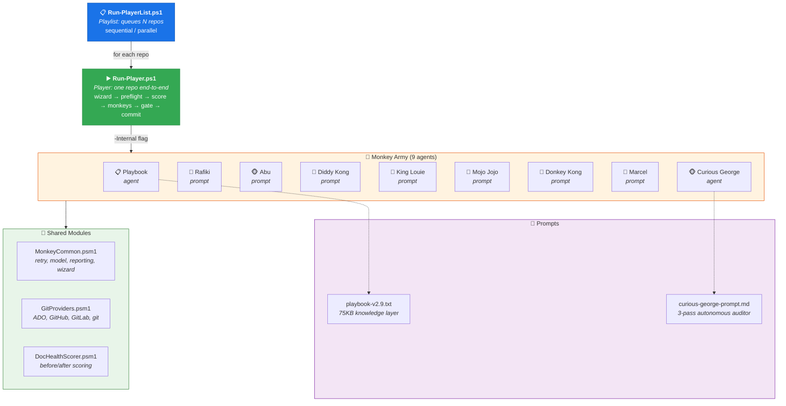

# 🎭 Playbook — Autonomous Documentation Framework

> *Give any codebase to the Monkey Army. Get production-grade documentation back.*

A self-orchestrating documentation pipeline powered by **9 specialized AI agents** ("monkeys") and a **knowledge layer generator** — all driven by GitHub Copilot CLI. Works on **any codebase, any language**. Zero manual config.

```powershell
# One repo
.\Run-Player.ps1 -RepoPath "C:\myrepo" -Pack full -CommitMode commit

# Multiple repos as a playlist
.\Run-PlayerList.ps1 -Repos @("C:\repo-a", "https://github.com/org/repo-b.git") -Mode parallel
```

📖 **[Playbook deep-dive →](PLAYBOOK.md)** — How the knowledge layer generator works (Phase 0)

---

## Why Playbook?

| Problem | How Playbook solves it |
|---------|----------------------|
| Docs rot faster than code | 🐵 **Marcel** detects stale references; **doc self-healing** triggers on every question |
| New devs can't navigate large codebases | 📋 **Playbook** generates copilot-instructions, workflow docs, architecture maps |
| Security blind spots in undocumented code | 🦹 **Mojo Jojo** hunts crash-prone patterns; 👑 **King Louie** validates API contracts |
| Test coverage gaps hide behind LOC metrics | 🦍 **Donkey Kong** finds untested modules by file pairing, not code coverage % |
| AI agents hallucinate without grounding | 🐒 **Rafiki** reads every entry point; 🐵 **Abu** cross-references code vs docs |
| Manual doc efforts don't scale | 🐵 **Curious George** runs autonomously for hours — discovery → questions → fixes |

---

## Quick Start

```powershell
# 1. Clone playbook
git clone https://github.com/KoushikMakam/playbook.git
cd playbook

# 2. Run on your repo (interactive wizard guides you)
.\Run-Player.ps1 -RepoPath "C:\your-repo"

# 3. Or go fully non-interactive
.\Run-Player.ps1 -RepoPath "C:\your-repo" -Pack full -NonInteractive `
  -QuestionsPerEntry 10 -CommitMode commit -TargetAgents copilot
```

### Prerequisites

| Tool | Install | Required |
|------|---------|----------|
| PowerShell 7+ | `winget install Microsoft.PowerShell` | ✅ |
| Git 2.30+ | `winget install Git.Git` | ✅ |
| GitHub Copilot CLI | `npm install -g @githubnext/copilot-cli` | ✅ |
| Azure CLI | `winget install Microsoft.AzureCLI` | Only for ADO repos |
| GitHub CLI | `winget install GitHub.cli` | Only for GitHub PRs |

---

## Repository Structure

```
playbook/
├── Run-Player.ps1              ← ▶️  Player — single-repo orchestrator
├── Run-PlayerList.ps1          ← 📋 PlayerList — multi-repo playlist runner
├── README.md                   ← You are here
├── PLAYBOOK.md                 ← Knowledge layer generator deep-dive
│
├── monkey-army/                ← 🐒 All 9 monkey scripts
│   ├── playbook-runner.ps1     ←   Phase 0: Knowledge layer generator (agent-mode)
│   ├── rafiki.ps1              ←   Phase 1: Code reader — broad questions per entry point
│   ├── abu.ps1                 ←   Phase 2: Doc gap detective — code vs docs cross-ref
│   ├── diddy-kong.ps1          ←   Phase 3: Architecture mapper — deps, cycles, violations
│   ├── king-louie.ps1          ←   Phase 4: API contract validator — specs vs endpoints
│   ├── mojo-jojo.ps1           ←   Phase 5: Chaos finder — security, edge cases, crashes
│   ├── donkey-kong.ps1         ←   Phase 6: Test coverage hunter — untested modules
│   ├── marcel.ps1              ←   Phase 7: Stale doc detector — dead refs, renames
│   └── curious-george.ps1      ←   Phase 8: Deep autonomous auditor (agent-mode)
│
├── shared/                     ← 🔧 Shared infrastructure
│   ├── MonkeyCommon.psm1       ←   Core engine (retry, model, reporting, wizard, UI)
│   ├── GitProviders.psm1       ←   Pluggable git (ADO, GitHub, GitLab, plain git)
│   └── DocHealthScorer.psm1    ←   Before/after doc health scoring (0–110)
│
└── prompts/                    ← 📝 AI prompts
    ├── playbook-v2.9.txt       ←   75KB knowledge layer mega-prompt (7 phases)
    └── curious-george-prompt.md←   3-pass autonomous auditor prompt
```

---

## Architecture



### Pipeline Flow

```mermaid
flowchart LR
    A["🧙 Wizard<br/>collect inputs"] --> B["✅ Preflight<br/>verify tools"]
    B --> C["🔀 Repo Setup<br/>clone/branch"]
    C --> D["🤖 Model Select<br/>auto-probe"]
    D --> E["📊 Health ①<br/>baseline score"]
    E --> F["🐒 Run Monkeys<br/>phase 0–8"]
    F --> G["🚦 Quality Gate<br/>pass/fail"]
    G --> H["🩹 Heal Mode<br/>retry failures"]
    H --> I["📊 Health ②<br/>delta score"]
    I --> J["💾 Commit<br/>stage changes"]
    J --> K["📬 PR Create<br/>ADO/GitHub"]
    K --> L["📄 Report<br/>JSON + console"]

    style A fill:#e3f2fd,stroke:#1565c0
    style E fill:#fff8e1,stroke:#f9a825
    style F fill:#fff3e0,stroke:#e65100
    style G fill:#fce4ec,stroke:#c62828
    style I fill:#fff8e1,stroke:#f9a825
    style L fill:#e8f5e9,stroke:#2e7d32
```



---

## The Roster — 9 Monkeys

| Phase | Monkey | Mode | What it does | Key metric |
|:-----:|--------|:----:|--------------|------------|
| 0 | 📋 **Playbook** | agent | Generates knowledge layer (instructions, skills, workflows, manifest) | Docs created |
| 1 | 🐒 **Rafiki** | prompt | Reads ALL entry points, asks broad questions per method | Entry points covered |
| 2 | 🐵 **Abu** | prompt | Cross-references code vs docs, finds & fills gaps | Gaps filled |
| 3 | 🐒 **Diddy Kong** | prompt | Maps dependencies, finds circular deps, orphans, layer violations | Cycles found |
| 4 | 👑 **King Louie** | prompt | Validates API contracts — specs vs actual endpoints | Contract mismatches |
| 5 | 🦹 **Mojo Jojo** | prompt | Hunts security issues, edge cases, crash-prone patterns | Risks flagged |
| 6 | 🦍 **Donkey Kong** | prompt | Finds untested files, under-tested modules | Untested files |
| 7 | 🙈 **Marcel** | prompt | Detects stale references — dead file paths, renamed classes | Stale refs found |
| 8 | 🐵 **Curious George** | agent | Deep 3-pass autonomous audit (discover → question → fix) | Domains audited |

> **Prompt mode** — one question at a time via `copilot -p`, per-question tracking, structured results.
> **Agent mode** — autonomous multi-hour session via `copilot --prompt`, reads/writes files directly.

📖 See **[PLAYBOOK.md](PLAYBOOK.md)** for Phase 0 deep-dive (the knowledge layer generator).

---

## Packs — Pick Your Squad

| Pack | Monkeys | Best for | Est. time |
|------|---------|----------|-----------|
| `full` | All 9 | Complete documentation overhaul | 4–8 hours |
| `audit` | Rafiki, Abu, Mojo Jojo | Quick code + doc + security sweep | 1–2 hours |
| `security` | Mojo Jojo, King Louie | Security & API contract focus | 30–60 min |
| `docs` | Playbook, Rafiki, Abu, Marcel | Doc generation & cleanup | 2–4 hours |
| `autonomous` | Playbook, Curious George | Hands-off agent-mode runs | 3–6 hours |
| `quick` | Rafiki, Abu | Fast code reading + gap detection | 30–60 min |

Or pick specific monkeys: `-Monkeys rafiki,mojo-jojo,marcel`

---

## Usage Examples

### ▶️ Single Repo (Run-Player)

```powershell
# Full pipeline — commit results
.\Run-Player.ps1 -RepoPath "C:\myrepo" -Pack full -CommitMode commit

# Quick audit — dry-run (no changes committed)
.\Run-Player.ps1 -RepoPath "C:\myrepo" -Pack audit -CommitMode dry-run

# Clone a remote repo + security scan + auto-create PR
.\Run-Player.ps1 -RepoUrl "https://github.com/org/repo.git" `
  -Pack security -CommitMode commit -CreatePR

# CI/CD mode — fully non-interactive
.\Run-Player.ps1 -RepoPath "C:\myrepo" -Pack full -NonInteractive `
  -CommitMode commit -Model "claude-sonnet-4" -TargetAgents copilot

# Custom monkeys with tuning
.\Run-Player.ps1 -RepoPath "C:\myrepo" -Monkeys rafiki,abu,marcel `
  -QuestionsPerEntry 15 -CommitMode dry-run
```

### 📋 Multiple Repos (Run-PlayerList)

```powershell
# Sequential — two repos, same config
.\Run-PlayerList.ps1 -Repos @(
    "C:\Repo\SampleApp",
    "https://github.com/org/data-plane.git"
) -Pack full -QuestionsPerEntry 10 -CommitMode commit

# Parallel — 3 repos at once
.\Run-PlayerList.ps1 -Repos @(
    "C:\Repo\ServiceA",
    "C:\Repo\ServiceB",
    "C:\Repo\ServiceC"
) -Mode parallel -MaxParallel 3 -Pack audit -CommitMode dry-run

# Per-repo overrides via hashtables
.\Run-PlayerList.ps1 -Repos @(
    @{ Path = "C:\Repo\SampleApp"; BaseBranch = "develop"; Pack = "full" },
    @{ Url = "https://dev.azure.com/org/proj/_git/SampleService"; BaseBranch = "main"; Pack = "audit" }
) -QuestionsPerEntry 10 -CommitMode commit

# Load repos from a JSON file
.\Run-PlayerList.ps1 -ReposFile ".\my-repos.json" -Mode sequential
```

<details>
<summary>📄 Example my-repos.json</summary>

```json
[
  {
    "Path": "C:\\Repo\\SampleApp",
    "BaseBranch": "develop",
    "BranchName": "feature/copilot-knowledge-layer"
  },
  {
    "Url": "https://dev.azure.com/org/proj/_git/SampleService",
    "BaseBranch": "feature/copilot-knowledge-layer",
    "UseBaseBranch": true
  }
]
```
</details>

### 🐒 Individual Monkey (standalone)

```powershell
.\monkey-army\rafiki.ps1 -RepoPath "C:\myrepo" -QuestionsPerEntry 5 -DryRun
.\monkey-army\abu.ps1 -RepoPath "C:\myrepo" -QuestionsPerGap 3 -Commit
.\monkey-army\mojo-jojo.ps1 -RepoPath "C:\myrepo" -QuestionsPerFile 5 -DryRun
```

---

## How It Works

The pipeline runs 12 steps end-to-end (see **Pipeline Flow** diagram above for visual):

### Doc Self-Healing 🔄

Every question sent to Copilot includes a suffix that triggers **doc self-healing** — if the answer reveals missing or incomplete documentation, Copilot creates or updates it automatically. This means every monkey is simultaneously an auditor and a fixer.

### Quality Gate

| Check | Threshold | Action on fail |
|-------|-----------|---------------|
| Monkey success count | ≥ 1 | Block commit |
| Answer rate | ≥ 50% | Block commit |
| File changes | > 0 | Warning only |

### Heal Mode

When `-HealMode` is enabled, failed monkeys are re-run with an escalated model (e.g., `claude-opus-4.7` for medium repos, `claude-sonnet-4` → `claude-opus-4.7`).

---

## Doc Health Score

Every run measures your repo's documentation health **before** and **after**, producing a 0–110 score with a letter grade.

| Category | Max | What it measures |
|----------|:---:|-----------------|
| 📝 Code Documentation | 20 | README quality, build/test docs, entry point doc comments |
| ✨ Doc Quality | 20 | Dead references, freshness vs code changes, navigation/indexes |
| 🤖 AI Friendliness | 25 | Agent configs, architecture docs, code clarity, project layout |
| 🧪 Test Coverage | 15 | Source→test file pairing, CI/test infrastructure |
| ⚠️ Risk Signals | 20 | Hardcoded secrets, empty catch blocks, TODO/FIXME density |
| 🐒 Monkey Army Bonus | +10 | copilot-instructions, skills dir, manifest, workflow docs |

### Multi-Agent Scoring

AI Friendliness is scored for the agents **you** use — specify via `-TargetAgents`:

| Agent | Config files checked |
|-------|---------------------|
| `copilot` | `.github/copilot-instructions.md`, `AGENTS.md` |
| `cursor` | `.cursorrules`, `.cursor/rules` |
| `claude` | `CLAUDE.md` |
| `coderabbit` | `.coderabbit.yaml` |
| `aider` | `.aider.conf.yml`, `.aiderignore` |
| `windsurf` | `.windsurfrules` |

### Grade Scale

| A | B | C | D | F |
|---|---|---|---|---|
| 90%+ | 75–89% | 60–74% | 45–59% | < 45% |

### Example Before/After

> 📊 **DOC HEALTH — BEFORE vs AFTER**

| Category | Before | After | Delta |
|----------|:------:|:-----:|:-----:|
| 📝 Code Documentation | 12 | 16 | **+4** |
| ✨ Doc Quality | 4 | 14 | **+10** |
| 🤖 AI Friendliness | 16 | 23 | **+7** |
| 🧪 Test Coverage | 2 | 2 | 0 |
| ⚠️ Risk Signals | 18 | 18 | 0 |
| 🐒 Monkey Army Bonus | 3 | 9 | **+6** |
| **TOTAL** | **55** | **82** | **+27** |

> **Grade: D → B** (55 → 82, delta: +27) 🎉

### Standalone Scoring

```powershell
Import-Module .\shared\DocHealthScorer.psm1
$score = Get-DocHealthScore -RepoPath "C:\myrepo" -TargetAgents copilot,cursor -IncludeBonus
```

---

## Input Wizard

The interactive wizard collects everything upfront (skip with `-NonInteractive`):

| Group | What it asks | Who needs it |
|-------|-------------|--------------|
| **Repository** | URL/path, clone dir, base branch | All |
| **Execution** | Pack/monkeys, branch strategy, commit mode, PR? | Player |
| **Model** | Preference or auto-detect (probes available models) | All |
| **Tuning** | Questions per entry/gap/file | Prompt-mode monkeys |
| **AI Targets** | Which AI agents to score for | Health scorer |
| **Curious George** | Qs/domain, focus, difficulty, max-skip, fix mode, discovery | George only |

---

## Git Provider Support

| Provider | Auto-detected by | PR tool | Auth check |
|----------|-----------------|---------|------------|
| **ADO** | `dev.azure.com`, `visualstudio.com` | `az repos pr create` | `az account show` |
| **GitHub** | `github.com` | `gh pr create` | `gh auth status` |
| **GitLab** | `gitlab.com` | `glab mr create` | `glab auth status` |
| **git** | fallback | Manual PR | Always passes |

Override with `-GitProvider ado|github|gitlab|git`.

---

## Standardized Monkey Contract

Every monkey returns the same result shape for unified reporting:

```json
{
  "MonkeyName": "Rafiki",
  "ExitStatus": "SUCCESS | PARTIAL | FAILED | SKIPPED",
  "QuestionsAsked": 50,
  "QuestionsAnswered": 47,
  "DocRefsFound": 38,
  "FilesModified": 12,
  "DocsGroundedPct": 80.8,
  "RetryCount": 3,
  "Duration": "00:45:12",
  "Model": "claude-sonnet-4",
  "Errors": []
}
```

---

## Output Structure

```
.monkey-output/
├── army-report.json               ← Unified results + health scores
├── health-before.json             ← Pre-run health snapshot
├── health-after.json              ← Post-run health snapshot
├── rafiki/                        ← Per-monkey output
│   ├── summary.json
│   ├── questions.json
│   ├── healing-report.json
│   └── doc-coverage-by-entrypoint.json
├── abu/
├── mojo-jojo/
├── ...
└── session-logs/                  ← Copilot session transcripts (*.md)
```

---

## Language Support

All monkeys are **language-agnostic** — entry point discovery uses pattern matching per language:

| Language | Entry point patterns |
|----------|---------------------|
| C# | `*Controller.cs`, `*Handler.cs`, `Program.cs`, `Startup.cs` |
| Python | `app.py`, `main.py`, `*_handler.py`, `views.py` |
| JavaScript/TypeScript | `index.ts`, `server.ts`, `*Controller.ts`, `*Route.ts` |
| Java | `*Controller.java`, `*Application.java`, `*Handler.java` |
| Go | `main.go`, `handler.go`, `*_handler.go` |
| Ruby | `*_controller.rb`, `application.rb` |
| And more... | PHP, Kotlin, Rust, Swift — pattern-based discovery |

---

## License

MIT
