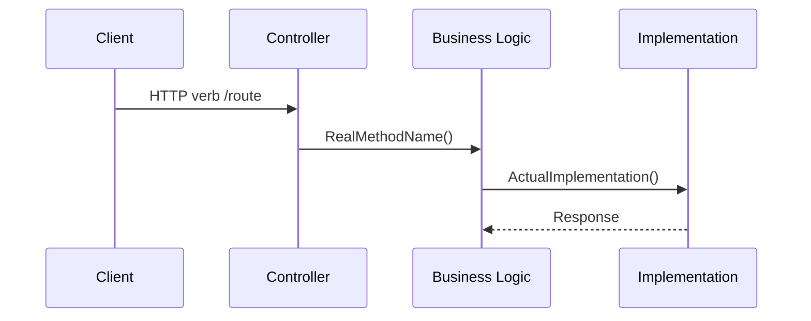

# Workflow Documentation Standard

Every workflow doc in `docs/knowledge/workflows/` MUST follow this structure.

## Required Sections (in order)

```
## Related Docs
## 1. Overview
## 2. Trigger Points          ← or "Key Components" for background workers
## 3. API Endpoints            ← or "Key Workers" for background workers
## 4. Request/Response Flow
## 5. Sequence Diagram         ← MUST contain ```mermaid sequenceDiagram block
## 6. Key Source Files
## 7. Configuration Dependencies
## 8. Telemetry & Logging
## 9. How to Debug
## 10. Error Scenarios
```

## Mermaid Diagram Rules

Every workflow doc MUST include at least one mermaid sequence diagram:



- Use REAL method names from source code (never fabricate)
- Minimum 4 participants for cross-layer flows
- Show decision points with `alt`/`opt` blocks
- Include error paths as `alt` branches

## Section Numbering

- Use `## N.` format (e.g., `## 1. Overview`, not `## Overview`)
- Additional sections (§11+) are encouraged but §1-§10 + mermaid are the minimum

## Content Rules

- All content MUST reference real source code paths, class names, and method names
- No placeholder text like "TODO" or "TBD" in final docs
- Tables preferred over prose for structured data (endpoints, config keys, errors)
